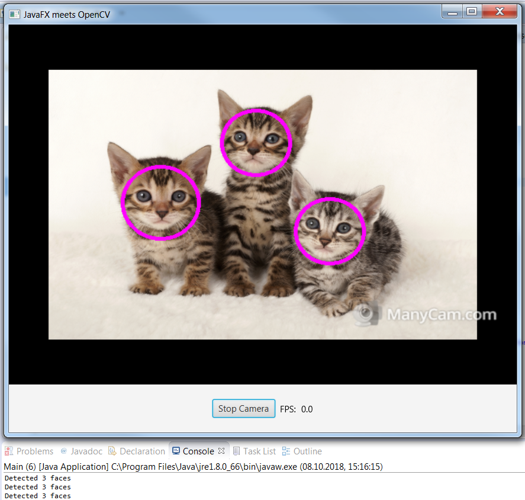

# 🐱 Cat Face Detector with OpenCV and JavaFX ☕️

This is a Cat Face Detector written in Java using **OpenCV (Open Source Computer Vision)**.  
It's a small application, but it shows you how to: 

- Access to the camera
- Make pictures with the camera and render it as a video (FPS / frames per second)
- Check pictures for patterns (in this case cat faces 🐱)
- Design a GUI for **OpenCV** Applications with JavaFX
- Get the number of detected Faces

## 🐱 Examples (Images) 🐱

The Face Detecting capabilities of **OpenCV (Open Source Computer Vision)** are working very well. 
It detects the faces that are detectable, when somebody doesn't look at the camera, the face isn't really detectable, but there are solutions to fix this problem. (Add more Patterns to search in Images as an example, but the application logically gets slower) (often a extended version of the haarcascade is available)

You can see here very clearly how **OpenCV** works, by detecting patterns in faces. 
The important Thing about this is, that it still was possible for the application to recognise the Cat Face Pattern (haarcascade_frontalcatface.xml) in different cats. 🐱

# ☕️ How to import a JavaFX Application to Eclipse ☕️

1. Open your existing workspace in Eclipse.
2. In the Eclipse menu, choose **File -> Import**.
3. Expand the General folder and select Existing Projects into Workspace, then click Next.
4. You should now see the Import Projects dialog.
5. Select Finish.
